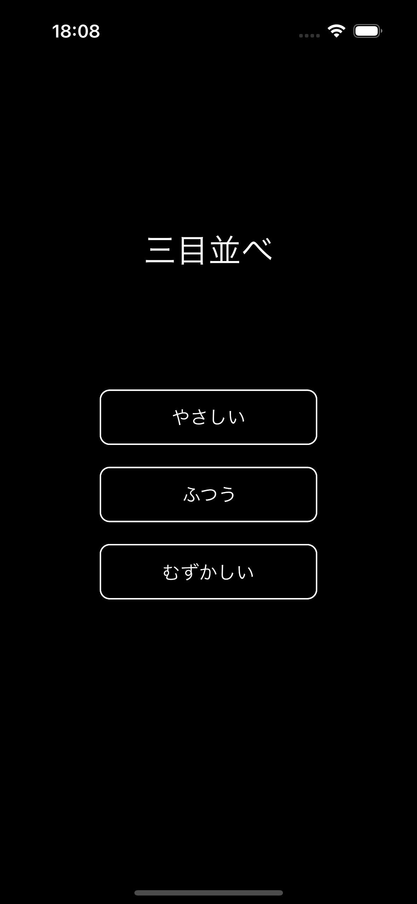
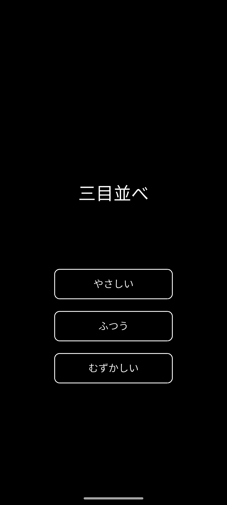
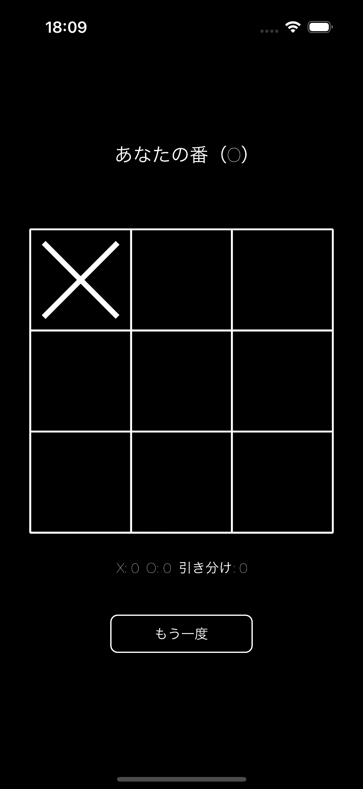
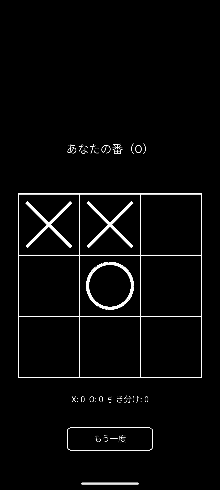

# Tic-Tac-Toe

Tic-Tac-Toe, implemented twice — once natively on iOS with Apple's own
[SpriteKit](https://developer.apple.com/documentation/spritekit) and
[GameplayKit](https://developer.apple.com/documentation/gameplaykit), and once on Android with
[bitzgroup/SpriteKit](https://github.com/bitzgroup/SpriteKit),
[bitzgroup/GameplayKit](https://github.com/bitzgroup/GameplayKit), and
[bitzgroup/GKSKBridge](https://github.com/bitzgroup/GKSKBridge) — Kotlin ports of those same two
Apple frameworks, plus the bridging surface between them.

The point isn't the game — it's the comparison. Both apps follow one shared design
([`docs/GAME_DESIGN.md`](docs/GAME_DESIGN.md)) down to the same scene graph shapes, the same
`GKGameModel`/`GKMinmaxStrategist`/`GKMonteCarloStrategist`-driven AI, and the same
`GKStateMachine` turn flow, so putting the two apps side by side is a direct demonstration that the
Android ports behave like the real, official frameworks they mirror.

Both apps' UI is localized — base language English, with a full Japanese localization — while this
repo's own documentation stays English-only, as is conventional for public OSS. See
[`docs/GAME_DESIGN.md`](docs/GAME_DESIGN.md)'s "Localization" section for details.

## Screenshots

Same layout, same grid, same win/loss/draw logic, same AI — side by side, on Apple's real
SpriteKit + GameplayKit and their Kotlin/Android ports.

<table>
<tr><th></th><th>iOS</th><th>Android</th></tr>
<tr>
<td><strong>Menu</strong></td>
<td></td>
<td></td>
</tr>
<tr>
<td><strong>Gameplay</strong></td>
<td></td>
<td></td>
</tr>
</table>

## Status

Phase 0 (repository scaffolding), Phase 1 (GameplayKit game model, AI, turn state machine),
Phase 2 (SpriteKit board rendering & input — `MenuScene`/`GameScene`, marks as entities, `en`/`ja`
localization), Phase 3 (platform app shells; both apps verified playable start-to-finish at all
three difficulties), Phase 4 (parity verification — Hard-mode move-for-move parity tests,
entity-lifecycle tests, a full `en`/`ja` visual pass on both platforms), and Phase 5 (polish —
win-particle burst, tap/win sound effects, app icons) are complete on both platforms, fully
unit-tested and visually/manually verified, including on physical devices. See
[`docs/ROADMAP.md`](docs/ROADMAP.md) for the phased plan and progress checklist.

## Repository layout

```text
tic-tac-toe/
├── docs/          # game design, architecture, and roadmap — read these first
├── ios/           # Swift app — Apple's official SpriteKit + GameplayKit
└── android/       # Kotlin app — bitzgroup/SpriteKit + GameplayKit + GKSKBridge as git submodules
```

- [`docs/GAME_DESIGN.md`](docs/GAME_DESIGN.md) — the one game spec (rules, AI, presentation) both
  apps implement
- [`docs/ARCHITECTURE.md`](docs/ARCHITECTURE.md) — repository/project layout, how the Android app
  embeds the three library submodules, how parity is verified
- [`docs/ROADMAP.md`](docs/ROADMAP.md) — phased implementation plan and progress checklist

See [`CLAUDE.md`](CLAUDE.md) for build/test commands.

## License

MIT — see [`LICENSE`](LICENSE).
